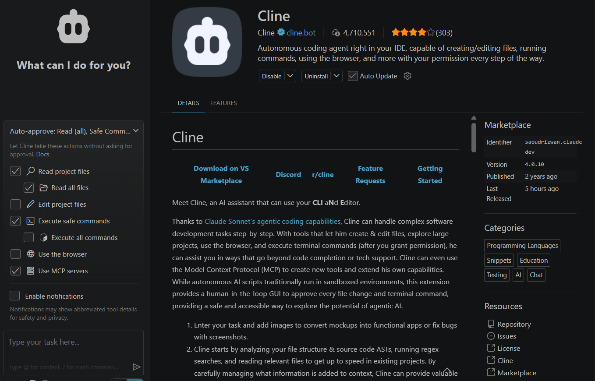

# A walkthrough of the IT Security Agent

This is a plain-language tour of what this project does and why it's built the way it is. The [README](../README.md) covers the exact setup commands; this document is more about the reasoning behind the pieces.

## What problem it's solving

Say you're maintaining a project with two hundred dependencies. Somewhere in that pile might be a package with a known, published security vulnerability. Finding out which one, if any, sounds like it should be a lookup: take the package name, search a vulnerability database, done.

It isn't that simple, because the two sides don't speak the same language. A dependency file identifies packages by purl, something like `pkg:pypi/django@2.2.0`. The National Vulnerability Database identifies software by CPE, a vendor and product string someone typed in by hand years ago, like `cpe:2.3:a:djangoproject:django:2.2.0`. Nothing guarantees those line up, and often they don't.

So a naive "search NVD for anything matching this package's name" approach pulls in a lot of noise. Search for a Python package called `arrow` and you'll get CPE entries for Cisco routers and Fujitsu hardware that happen to share the word "arrow" in a product line, somewhere in that pile is the one entry actually about the `arrow` library, and you have no easy way to tell which is which. Search for `babel` and you'll collide with a completely unrelated JavaScript compiler that also happens to be called Babel. When this project built a real training set from CPE Dictionary lookups, out of 17,090 candidate (package, vendor) pairs, only about 1,995, roughly 12%, turned out to actually be the same project. The rest were name coincidences.

That 12% is the reason this project has a machine learning model in it at all. A person could eyeball a handful of these and spot the fakes by hand. Across every dependency in a real project, at scale, you need something that scores how likely a match is real and flags the uncertain ones, rather than trusting every name match or throwing out everything that isn't an exact string match.

## Following a scan through the code

**Step one: get a list of what's actually installed.** There are three ways to start a scan, and by the time any of them finishes, the output looks the same either way: a plain list of packages with a name, version, and ecosystem.

- Hand it an existing SBOM (CycloneDX or SPDX), and `sbom.py` parses it.
- Hand it a container image, and `image_scan.py` runs it through Syft and parses whatever comes back.
- Or don't hand it anything at all, and let it read your repo's own lockfile: `uv.lock`, `package-lock.json`, or `requirements.txt`, via `repo_scan.py`.

That third option exists for a reason worth spelling out. An SBOM file someone hands you could be stale, or, in the worst case for a security tool, deliberately edited to hide a vulnerable dependency before it ever reaches the scanner. Reading the lockfile a repo already trusts and already resolves its own dependencies against removes that document from the trust boundary. The scan computes its own inventory instead of taking someone's word for it.

If a repo doesn't have an SBOM at all, `generate_sbom.py` builds one, a real CycloneDX document, straight out of whichever lockfile it finds. No Syft, no external tool, just the same parsers repo_scan.py already has.

**Step two: work out who actually made each package.** For every package name, `normalize.py` searches NVD's CPE Dictionary and scores each candidate vendor against it: does the name match closely, does the CPE entry's reference URL point at the same domain as the package's real PyPI or npm page, do the keywords in the product description even suggest the right programming language. None of this decides anything yet, it's just gathering evidence.

**Step three: check whether a real vulnerability actually applies.** `matching.py` takes those vendor candidates, pulls CVEs out of a local SQLite cache of NVD's catalog (built once ahead of time by `nvd_cache.py`, so a scan never has to make a live NVD call per package), and checks the affected version range on each CVE against the exact version installed. A name match with no matching vendor candidate becomes a rejected finding right here, this is exactly where a collision like `babel` gets caught and thrown out.

**Step four: score how confident the match actually is.** `model.py` loads a small classifier, logistic regression or a random forest, whichever one won a head-to-head comparison during training, and turns the vendor-match evidence into a probability. The training labels for that comparison aren't picked by hand; `labeling.py` builds them automatically from registry URL overlap, so the same person isn't writing the rule and grading it by eye.

**Step five: check what independent sources say.** For PyPI and npm packages specifically, `osv.py` asks OSV.dev whether it separately knows about a vulnerability in this exact package and version. `kev.py` checks CISA's list of vulnerabilities that are being actively exploited right now in the wild, not just theoretically possible.

**Step six: decide what to actually do about it.** `agent.py` is the policy that ties everything above together into four buckets:

- A hit on CISA's actively-exploited list always gets escalated to the top of the report, no matter what else is true.
- High model confidence confirms a finding on its own.
- Low model confidence still confirms if OSV independently agrees.
- Low model confidence with no OSV backing goes into a human review queue, along with an explanation (more on that below) of which signals made the model unsure.
- Version mismatches and vendor collisions that never resolved go to rejected, still visible in the final report, not silently thrown away.

**Step seven: write it up.** `report.py` turns the result into a JSON file for other programs to read and an HTML file for a person to read, plus a summary of how often the model's confirmed findings agree with OSV, a rough sanity check on the whole matching pipeline's accuracy.

## The model, and why it isn't graded on plain accuracy

Two models get trained on the same data and compared head to head: logistic regression, kept mainly because it's easy to interpret, and a random forest, added as a second opinion. Neither one is judged on raw accuracy. Missing a real vulnerability (a false negative) is treated as ten times worse than sending something harmless to human review (a false positive), and whichever model scores better on that weighted measure gets saved and used. The same weighting also picks the confidence threshold used at scan time, swept across a range of values and set wherever it minimizes that weighted cost on held-out data, rather than a flat 0.5 cutoff picked out of habit.

One design choice worth explaining directly: the registry-URL-overlap signal builds the training labels, but it's never given to the model as an input feature. If it were, the model could just learn "predict real match whenever this one signal is true," which is memorizing the label rather than learning anything about the underlying evidence.

For anything that lands in the review queue, `explain.py` attaches a SHAP breakdown showing which features pushed the model's confidence up or down. The point is that a reviewer looking at an uncertain finding sees a reason, not just a bare number.

## The interface: Cline, not a custom dashboard

There's no web app planned for this project, and that's deliberate. The interface is meant to be a conversation, through [Cline](https://cline.bot), an AI coding agent that runs as a VS Code extension.

![Cline extension listing in the VS Code marketplace]

Cline sits inside your editor, has over 4.7 million installs, and can read your files, edit them, run terminal commands, and use a browser, all behind a permission model where you approve each action, or pre-approve categories of it, as shown in the panel on the left of that screenshot. One of those categories is "Use MCP servers": Cline can call out to external tools over the Model Context Protocol and fold whatever they return into its own answer.

That's exactly how this project plugs in, and unlike the Cline integration itself, this part is already built, not just planned. `it_security_agent/mcp_server.py` runs an MCP server with one tool, `scan_repo`, over Streamable HTTP, meaning it can live on a separate machine (say, next to a self-hosted model) instead of your own laptop. Because it's remote, it deliberately has no access to your filesystem: `scan_repo` takes a lockfile or SBOM's raw text as an argument, not a path, so Cline has to read the file locally first and pass its contents through.

A `.clinerules` file at the repo root tells Cline's model exactly how to do that: read the dependency file yourself, then call `scan_repo` with its content, then relay the result bucket by bucket (escalated first, then confirmed, then anything flagged for human review) without inventing a CVE number or severity that wasn't actually in the tool's output. It also tells the model not to panic if the first call takes a minute or two, that's the server syncing NVD's catalog before it can answer anything.

The setup this was built against runs the model side on a self-hosted Mistral-7B-Instruct through vLLM, registered in Cline as an OpenAI-compatible endpoint, with this repo's MCP server registered separately as a remote tool. The README has the exact commands for standing that up. The idea behind keeping the model self-hosted rather than a hosted API: Cline never touches your code without the request round-tripping through infrastructure you control end to end.

## What's tested and what's still unproven live

The suite currently runs 124 tests, all passing, with every network call, NVD, the CPE Dictionary, OSV, CISA, and the PyPI/npm registries, mocked, so running the tests never hits a live API or spends any of the rate limit. What hasn't been proven yet in a live environment: `image_scan.py`'s Syft integration is only exercised against a mocked subprocess call, since Syft and Docker haven't been available wherever this has run so far. The review queue's SHAP explanations have been exercised in unit tests and against a real training run's data, but hadn't yet fired on an actual ambiguous finding during a full live scan as of the last recorded run.

## Getting started

Requires Python 3.11+ and [uv](https://docs.astral.sh/uv/).

```
uv sync
```

An NVD API key is optional but worth setting up, drop it in a `.env` file at the repo root as `NVD_API_KEY=...`. Without one, every request to NVD is spaced six seconds apart instead of one, which adds up fast when syncing the full CVE catalog.

Run the tests:

```
uv run pytest
```

Run a full scan end to end, without the MCP server, through the notebook:

```
notebooks/week3_agent.ipynb
```

Run the MCP server on its own, so it can be registered as a remote tool in Cline:

```
uv run it-security-agent-mcp
```

See the README for the full steps to point Cline at a self-hosted model and register this server as a remote MCP tool.

## What each piece of the code actually does

| Module | Job |
|---|---|
| `schema.py` | The `Component` shape everything else agrees on |
| `sbom.py` | Parses CycloneDX/SPDX, and builds a CycloneDX document back out of a component list |
| `generate_sbom.py` | Builds an SBOM straight from a repo's own lockfiles, no external tool |
| `image_scan.py` | Scans a container image via Syft |
| `repo_scan.py` | Reads `uv.lock`, `package-lock.json`, or `requirements.txt` directly |
| `nvd_client.py`, `nvd_cache.py` | Pulls and locally caches the NVD CVE catalog |
| `cpe_dictionary.py` | Looks up CPE vendor/product candidates for a package name |
| `registry.py` | Fetches PyPI/npm metadata, used to check registry URL overlap |
| `normalize.py` | Scores CPE vendor candidates against a package |
| `matching.py` | Finds CVEs whose version range actually applies |
| `osv.py` | Cross-checks OSV.dev for PyPI/npm packages |
| `kev.py` | Checks CISA's actively-exploited vulnerability list |
| `labeling.py` | Builds training labels from registry overlap, no hand labeling |
| `model.py` | Trains and persists the winning classifier |
| `explain.py` | SHAP explanations for low-confidence findings |
| `agent.py` | The triage policy that ties it all together |
| `report.py` | Writes the JSON and HTML output |
| `mcp_server.py` | Exposes the whole pipeline to Cline as one MCP tool, `scan_repo` |

## Course context

This project was built for an AI & Ethics course, alongside earlier work on risk analysis (why a missed vulnerability should cost more than a false alarm) and fairness analysis (whether the model's error rate differs between PyPI and npm packages). Those earlier findings are the reason this ended up with a risk-weighted threshold and a human review queue instead of a model just tuned to maximize plain accuracy.
